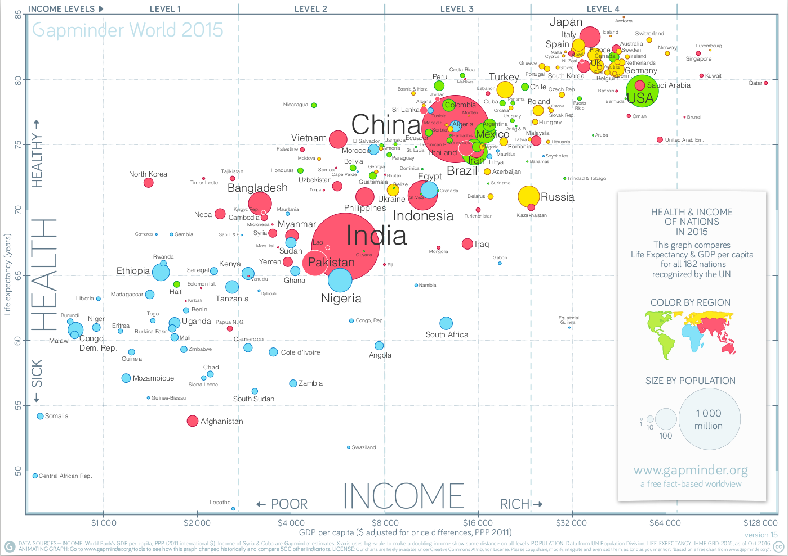

```{r setup, include=FALSE}
library(knitr)
library(kableExtra)
library(ggplot2)
library(emojifont)
library(here)

# Copied & modified from: https://github.com/gadenbuie/gentle-ggplot2 (Index.Rmd)
#
# Thanks to Garrick Aden-Buie (https://www.garrickadenbuie.com/) for sharing :)
#

knitr::opts_chunk$set(fig.width = 8.8, fig.height = 6.4, fig.retina = 1,
                      out.width = "100%",
                      message = FALSE, 
                      warning = FALSE, 
                      cache = FALSE, 
                      autodep = TRUE, 
                      hiline=TRUE)

knitr::opts_hooks$set(fig.callout = function(options) {
  if (options$fig.callout) {
    options$echo <- FALSE
    options$out.height <- "99%"
    options$fig.width <- 16
    options$fig.height <- 8
  }
  options
})

options(
  htmltools.dir.version = FALSE, 
  width = 90,
  # max.print = 9999,
  knitr.table.format = "html"
)

# Making some aesthetic changes for this document
# theme_set(theme_gray(base_size = 24))

#_# Readin the gapminder data now.
library(data.table)
gm <- fread(here("data", "gapminder.csv"))
```

class: middle, center

<div class="ggplot-logo-left-top"></div> 
<div class="gapminder-logo-left-bottom"></div>

# Introduction to `ggplot2`

<br>

### Saghir Bashir

#### [ilustat](https://ilustat.com/) & [GitHub: @saghirb](https://github.com/saghirb)<br>

### 28th Feb 2021


---
class: inverse, middle, center

# Relax

# Experiment

# Make Mistakes

# Learn

# Enjoy

---
class: middle, center

<div class="ggplot-logo-left-top"></div> 
<div class="gapminder-logo-left-bottom"></div>

# Outline

## Gapminder Data

## Plotting Data

## Facetting Plots

## Summary

---
class: center, middle

```{r, out.width="900px", echo=FALSE}

```


---
class: middle, left
<div class="gapminder-logo-right-top"></div>

# Gapminder Data

### - Population (Total)

### - GDP per capita (US$, inflation-adjusted)

### - Life expectancy at birth, in years

### - Infant Mortality per 1000 births

### - Total Fertility (children per woman)

---
class: middle, center
<div class="gapminder-logo-right-top"></div>

# First 10 Observations

```{r headgm, echo=FALSE, eval=TRUE}
head(gm, n=10) %>% kable(align = 'cccrrrrr', format='html', 
                         digits = 2, padding = 2)
```

---
class: middle, center
<div class="gapminder-logo-right-top"></div>

# Last 10 Observations

```{r tailgm, echo=FALSE, eval=TRUE}
tail(gm, n=10) %>% kable(align = 'cccrrrrr', format='html', 
                         digits = 2, padding = 2)
```

---
<div class="gapminder-logo-right-top"></div>
# Questions of Interest

<br>

### What are the time trends for Portugal?

### How does Portugal compare to other European countries?

### How does Portugal perform on health and wealth?

---
class: center, middle

```{r, out.width = "400px", echo=FALSE}
knitr::include_graphics("images/hex-ggplot2.png")
```

---
class: inverse, center, middle

## `install.packages("ggplot2")`
## `install.packages("magrittr")`
## `install.packages("data.table")`
## `install.packages("here")`

---
<div class="rdatatable-logo-right-top"></div>

# Imported Gapminder Data

```{r importgmshow, echo=TRUE, eval=TRUE}
library(data.table)
library(here)

gm <- fread(here("data", "gapminder.csv"))

# Create factor (categorical) variables to be used later.

gm[, continent:=as.factor(continent)]

gm[, country:=as.factor(country)]

gm[, fyear:=as.factor(year)]
```

---
<div class="gapminder-logo-right-top"></div>

# Look at Imported Data

```{r gmDataLook, echo=TRUE, eval=FALSE}
gm
```


```{r Importedgm, echo=FALSE, eval=TRUE}
widthDefault <- getOption("width")
options(width = 100)
gm
options(width = widthDefault)
```

---
<div class="rlogo-logo-right-top"></div>

# Structure of Gapminder Data
```{r gmstructure, echo=TRUE, eval=TRUE, highlight.output=c(2, 3, 10)}
str(gm)
```

---
class: inverse, center, middle

# What are the time trends for Portugal?

---
<div class="rdatatable-logo-right-top"></div>
# Portuguese Data

### Create a dataset for Portugal

```{r gmGubsets}
# Portuguese Data
options(width = 100)
gmPT <- gm[country == "Portugal"]
gmPT
options(width = widthDefault)
```

---
layout: true
<div class="ggplot2-hex-right-top"></div>

## Life Expectancy
---

.left-code[
<br>
```{r gmPT-01, eval=FALSE}
ggplot(gmPT)
```
]

.right-plot[
```{r gmPT-plot-01, ref.label='gmPT-01', echo=FALSE, out.width="100%"}
```
]

---
<div class="ggplot2-hex-right-top"></div>

.left-code[
<br>
```{r gmPT-02, eval=FALSE}
ggplot(gmPT, aes(year, lifeexp)) #<<
```
]

.right-plot[
```{r gmPT-plot-02, ref.label='gmPT-02', echo=FALSE, out.width="100%"}
```
]

---
layout: true
<div class="ggplot2-hex-right-top"></div>

## Life Expectancy - Points
---

.left-code[
<br>
```{r gmPT-03, eval=FALSE}
ggplot(gmPT, aes(year, lifeexp)) +
  geom_point() #<<
```
]

.right-plot[
```{r gmPT-plot-03, ref.label='gmPT-03', echo=FALSE, out.width="100%"}
```
]

---
layout: true
<div class="ggplot2-hex-right-top"></div>

## Life Expectancy - Line
---

.left-code[
<br>
```{r gmPT-04, eval=FALSE}
ggplot(gmPT, aes(year, lifeexp)) +
  geom_line() #<<
```
]

.right-plot[
```{r gmPT-plot-04, ref.label='gmPT-04', echo=FALSE, out.width="100%"}
```
]

---
layout: true
<div class="ggplot2-hex-right-top"></div>

## Life Expectancy - Points & Line
---

.left-code[
<br>
```{r gmPT-05, eval=FALSE}
ggplot(gmPT, aes(year, lifeexp)) +
  geom_point() + #<<
  geom_line() #<<
```
]

.right-plot[
```{r gmPT-plot-05, ref.label='gmPT-05', echo=FALSE, out.width="100%"}
```
]

---
layout: true
<div class="ggplot2-hex-right-top"></div>

## Life Expectancy - Colour
---

.left-code[
<br>
```{r gmPT-06, eval=FALSE}
ggplot(gmPT, aes(year, lifeexp)) +
  geom_point(colour="blue") +  #<<
  geom_line(colour="blue") #<<
```
]

.right-plot[
```{r gmPT-plot-06, ref.label='gmPT-06', echo=FALSE, out.width="100%"}
```
]

---
layout: true
<div class="ggplot2-hex-right-top"></div>

## Life Expectancy - Y-axis
---

.left-code[
<br>
```{r gmPT-08, eval=FALSE}
ggplot(gmPT, aes(year, lifeexp)) +
  geom_point(colour="blue") + 
  geom_line(colour="blue") +
  scale_y_continuous(  #<<
                limits=c(0, 80))  #<<
```
]

.right-plot[
```{r gmPT-plot-08, ref.label='gmPT-08', echo=FALSE, out.width="100%"}
```
]

---
layout: true
<div class="ggplot2-hex-right-top"></div>

## Life Expectancy - Axis labels
---

.left-code[
<br>
```{r gmPT-10, eval=FALSE}
ggplot(gmPT, aes(year, lifeexp)) +
  geom_point(colour="blue") + 
  geom_line(colour="blue") +
  scale_y_continuous( 
                limits=c(0, 80)) +
  xlab("Year") +  #<<
  ylab("Life Expectancy at Birth") #<<
```

<br>

### Interpret this plot.
]

.right-plot[
```{r gmPT-plot-10, ref.label='gmPT-10', echo=FALSE, out.width="100%"}
```
]

---
layout: false
class: inverse, center, middle

# Exercises

### Download: https://ilustat.com/shared/ggplot2-Intro.zip

### Double Click on "`ggplot2-Exercises.Rproj`"

### Open file "`ggplot2-Exercises.Rmd`"

### Complete "Exercise 1 - Portugal"

---
<div class="ggplot2-hex-right-top"></div>

## Some comments (i)

.left-code[
### Piping data to `ggplot2`

```{r gmPT-12, eval=FALSE}
library(magrittr)

gm[country=="Portugal"] %>%   #<<
ggplot(aes(year, lifeexp)) +
  geom_point(colour="darkred") +
  geom_line(colour="darkgreen") +
  scale_y_continuous( 
                limits=c(0, 80)) +
  xlab("Year") +
  ylab("Life Expectancy at Birth")
```
]

.right-plot[
```{r gmPT-plot-12, ref.label='gmPT-12', echo=FALSE, out.width="100%"}
```
]

---
layout: true

<div class="ggplot2-hex-right-top"></div>

## Some comments (ii)
---

.left-code[
### Order matters

```{r gmPT-14, eval=FALSE}
gm[country=="Portugal"] %>% 
ggplot(aes(year, lifeexp)) +
  geom_line(colour="darkgreen") +  #<<
  geom_point(colour="darkred") +  #<<
  scale_y_continuous( 
                limits=c(0, 80)) +
  xlab("Year") +
  ylab("Life Expectancy at Birth")
```
]

.right-plot[
```{r gmPT-plot-14, ref.label='gmPT-14', echo=FALSE, out.width="100%"}
```
]

---
layout: false
class: inverse, center, middle

# How does Portugal compare to other European countries?

---
layout: true

<div class="ggplot2-hex-right-top"></div>

## Life Expectancy - Points
---

.left-code[
### European Countries

```{r gmEU-12, eval=FALSE}
gm[continent=="Europe"] %>% 
ggplot(aes(year, lifeexp)) + 
geom_point(colour="grey75") + #<<
scale_y_continuous(limits=c(60,85))
```
]

.right-plot[
```{r gmEU-plot-12, ref.label='gmEU-12', echo=FALSE, out.width="100%"}
```
]

---
layout: true

<div class="ggplot2-hex-right-top"></div>

## Life Expectancy - Points
---

.left-code[
### Add Portugal (blue)
```{r gmEU-14, eval=FALSE}
gm[continent=="Europe"] %>% 
ggplot(aes(year, lifeexp)) + 
geom_point(colour="grey75") + 
geom_point(data=gmPT, #<<
          colour="blue") + #<<
scale_y_continuous(limits=c(60,85))
```
]

.right-plot[
```{r gmEU-plot-14, ref.label='gmEU-14', echo=FALSE, out.width="100%"}
```
]

---
layout: true

<div class="ggplot2-hex-right-top"></div>

## Life Expectancy - Jitter
---

.left-code[
### Jitter overlapping points

```{r gmEU-16, eval=FALSE}
gm[continent=="Europe"] %>% 
ggplot(aes(year, lifeexp)) + 
geom_jitter(colour="grey75") + #<<
geom_point(data=gmPT, 
          colour="blue") + 
scale_y_continuous(limits=c(60,85))
```
]

.right-plot[
```{r gmEU-plot-16, ref.label='gmEU-16', echo=FALSE, out.width="100%"}
```
]

---
layout: true

<div class="ggplot2-hex-right-top"></div>

.left-code[
### Make points smaller

```{r gmEU-20, eval=FALSE}
gm[continent=="Europe"] %>% 
ggplot(aes(year, lifeexp)) + 
geom_jitter(colour="grey75",
            width = 0.7, #<<
            size = 0.7) + #<<
geom_point(data=gmPT, size=0.7,
          colour="blue") + 
scale_y_continuous(limits=c(60,85))
```
### 'width` - Amount of jitter
]

.right-plot[
```{r gmEU-plot-20, ref.label='gmEU-20', echo=FALSE, out.width="100%"}
```
]

---
layout: true

<div class="ggplot2-hex-right-top"></div>

## Life Expectancy - Boxplot
---

.left-code[
<br>

```{r gmEU-24, eval=FALSE}
gm[continent=="Europe"] %>% 
ggplot(aes(fyear, lifeexp)) + #<<
geom_boxplot() + #<<
geom_point(data=gmPT, 
          colour="blue") + 
scale_y_continuous(limits=c(60,85))
```
### `fyear` is a factor variable
]

.right-plot[
```{r gmEU-plot-24, ref.label='gmEU-24', echo=FALSE, out.width="100%"}
```
]

---
layout: true

<div class="ggplot2-hex-right-top"></div>

## Life Expectancy - Boxplot
---

.left-code[
### Cleaner x-axis

```{r gmEU-28, eval=FALSE}
gm[continent=="Europe"] %>% 
ggplot(aes(fyear, lifeexp)) + 
geom_boxplot() + 
geom_point(data=gmPT, 
           colour="blue") + 
scale_x_discrete( #<<
  breaks=seq(1960, 2010, 10)) + #<<
scale_y_continuous(limits=c(60,85))
```
]

.right-plot[
```{r gmEU-plot-28, ref.label='gmEU-28', echo=FALSE, out.width="100%"}
```
]

---
layout: true

<div class="ggplot2-hex-right-top"></div>

## Life Expectancy - Boxplot
---
<div class="ggplot2-hex-right-top"></div>

.left-code[
### Modify points

```{r gmEU-30, eval=FALSE}
gm[continent=="Europe"] %>% 
ggplot(aes(fyear, lifeexp)) + 
geom_boxplot(outlier.size = .5) + #<<
geom_point(data=gmPT, 
           shape = 2, #<<
           colour="blue") + 
scale_x_discrete( 
  breaks=seq(1960, 2010, 10)) + 
scale_y_continuous(limits=c(60,85))
```
]

.right-plot[
```{r gmEU-plot-30, ref.label='gmEU-30', echo=FALSE, out.width="100%"}
```
]

---
layout: false

<div class="ggplot2-hex-right-top"></div>

## Shapes & Values

```{r shapes, echo=F, out.width="80%", fig.width = 8, fig.height = 5}
## A look at all 25 symbols
colsN <- 6
dfshapes <- as.data.table(list(value = 0:25))
dfshapes[, x:=(value %% colsN) + 1][
  , z:=floor((value)/colsN) + 1][
  , y:=max(z)-z][
  , z:=NULL]
  
ggplot(dfshapes, aes(x = x, y = y)) +
  geom_point(aes(shape = value), size = 4) + 
  scale_shape_identity() +
  theme_void() +
  geom_text(aes(label = value), nudge_x = -.3, size = 8)
```

---
layout: true

<div class="ggplot2-hex-right-top"></div>

## Life Expectancy - Boxplot
---

.left-code[
### Final

```{r gmEU-34, eval=FALSE}
gm[continent=="Europe"] %>% 
ggplot(aes(fyear, lifeexp)) + 
geom_boxplot(outlier.size = .5) + 
geom_point(data=gmPT, 
           shape = 4,
           colour="blue") + 
scale_x_discrete( 
  breaks=seq(1960, 2010, 10)) + 
scale_y_continuous(limits=c(60,85)) +
ggtitle("Portugal (x) in Europe") + #<<
xlab("Year") + #<<
ylab("Life Expectancy at Birth") #<<
```
]

.right-plot[
```{r gmEU-plot-34, ref.label='gmEU-34', echo=FALSE, out.width="100%"}
```
]


---
layout: true

<div class="ggplot2-hex-right-top"></div>

## Life Expectancy - Line Plot
---

.left-code[
### Line for each country

```{r gmEU-04, eval=FALSE}
gm[continent=="Europe"] %>% 
ggplot(aes(year, lifeexp, 
           group=country)) + #<<
geom_line(colour="grey80") +
scale_y_continuous(limits=c(0, 85))
```
]

.right-plot[
```{r gmEU-plot-04, ref.label='gmEU-04', echo=FALSE, out.width="100%"}
```
]

---
layout: true

<div class="ggplot2-hex-right-top"></div>

## Life Expectancy - Line Plot
---

.left-code[
<br>
```{r gmEU-08, eval=FALSE}
gm[continent=="Europe"] %>% 
ggplot(aes(year, lifeexp, 
           group=country)) + 
geom_line(colour="grey80") +
geom_line(data=gmPT, #<<
          colour="blue") + #<<
scale_y_continuous(limits=c(0, 85))
```

### Used `geom_line()` twice

See "`gghighlight`" package
]
.right-plot[
```{r gmEU-plot-08, ref.label='gmEU-08', echo=FALSE, out.width="100%"}
```
]


---
layout: false
class: inverse, center, middle

# Facetting Plots

---
layout: true

<div class="ggplot2-hex-right-top"></div>

## Life Expectancy - By Continent
---

.left-code[
### Facetting by continent

```{r gmFt-04, eval=FALSE, echo=TRUE}
gm[continent!="Oceania"] %>% 
ggplot(aes(fyear, lifeexp)) + 
geom_boxplot() + 
scale_x_discrete( 
  breaks=seq(1960, 2010, 10)) + 
scale_y_continuous(limits=c(40,85)) +
facet_wrap(~continent) #<<
```
]

.right-plot[
```{r gmFt-plot-04, ref.label='gmFt-04', echo=FALSE, out.width="100%"}
```
]

---
layout: true

<div class="ggplot2-hex-right-top"></div>

## Life Expectancy - By Continent
---

.left-code[
### Adding Portugal

```{r gmFt-08, eval=FALSE}
gm[continent!="Oceania"] %>% 
ggplot(aes(fyear, lifeexp)) + 
geom_boxplot() + 
geom_point(data=gmPT, #<<
           shape = 4, #<<
           colour="blue") + #<<
scale_x_discrete( 
  breaks=seq(1960, 2010, 10)) + 
scale_y_continuous(limits=c(40,85)) +
facet_wrap(~continent)
```
]

.right-plot[
```{r gmFt-plot-08, ref.label='gmFt-08', echo=FALSE, out.width="100%"}
```
]

---
layout: true

<div class="ggplot2-hex-right-top"></div>

## Life Expectancy - By Continent
---

.left-code[
### Reduce outlier size

```{r gmFt-12, eval=FALSE}
gm[continent!="Oceania"] %>% 
ggplot(aes(fyear, lifeexp)) + 
geom_boxplot(outlier.size = .5) + #<<
geom_point(data=gmPT, 
           shape = 4,
           colour="blue") +
scale_x_discrete( 
  breaks=seq(1960, 2010, 10)) + 
scale_y_continuous(limits=c(40,85)) +
facet_wrap(~continent)
```
]

.right-plot[
```{r gmFt-plot-12, ref.label='gmFt-12', echo=FALSE, out.width="100%"}
```
]

---
layout: true

<div class="ggplot2-hex-right-top"></div>

## Life Expectancy - By Continent
---

.left-code[
```{r gmFt-16, eval=FALSE}
gm[continent!="Oceania"] %>% 
ggplot(aes(fyear, lifeexp,
           colour = continent)) +  #<<
geom_boxplot(outlier.size = .5) +
geom_point(data=gmPT, 
           shape = 4,
           colour="blue") +
scale_x_discrete( 
  breaks=seq(1960, 2010, 10)) + 
scale_y_continuous(limits=c(40,85)) +
facet_wrap(~continent) +
xlab("Year") +
ylab("Life expectancy at Birth") +
theme(legend.position = "none") #<<
```
]

.right-plot[
```{r gmFt-plot-16, ref.label='gmFt-16', echo=FALSE, out.width="100%"}
```
]


---
layout: false
class: inverse, center, middle

# Exercises

### Double Click on "`ggplot2-Exercises.Rproj`"

### Open file "`ggplot2-Exercises.Rmd`"

### Complete "Exercise 2 - Europe"

---

class: inverse, center, middle

# How does Portugal perform on health and wealth?

---
<div class="gapminder-logo-right-top"></div>

## Health versus Wealth over Time

### We will only use data for 1960, 1980, 2000 and 2010.

### This is essentialy a subset of the famous gapminder plot

.pull-right[
```{r, out.width="450px", echo=FALSE}

```
]

---
layout: true

<div class="ggplot2-hex-right-top"></div>

## Health vs Wealth
---

.left-code[
### Colour code by year

```{r gmHW-04, eval=FALSE}
yrs <- c(1960,1980,2000,2010)
gm[continent=="Europe" & 
   year %in% yrs] %>% 
ggplot(aes(gdpPercap, lifeexp,
       colour=fyear)) + #<<
geom_point() 

```
### Not easy to interpret
]

.right-plot[
```{r gmHW-plot-04, ref.label='gmHW-04', echo=FALSE, out.width="100%"}
```
]

---
layout: true

<div class="ggplot2-hex-right-top"></div>

## Health vs Wealth - Facet
---

.left-code[
### Plot years separately

```{r gmHW-08, eval=FALSE}
yrs <- c(1960,1980,2000,2010)  #<<
gm[continent=="Europe" & 
   year %in% yrs] %>% 
ggplot(aes(gdpPercap, lifeexp,
       colour=fyear)) + 
geom_point() +
facet_wrap(~fyear) #<<

```
]

.right-plot[
```{r gmHW-plot-08, ref.label='gmHW-08', echo=FALSE, out.width="100%"}
```
]

---
layout: true

<div class="ggplot2-hex-right-top"></div>

## Health vs Wealth - Log Scale
---

.left-code[
### Log scale x-axis

```{r gmHW-10, eval=FALSE}
yrs <- c(1960,1980,2000,2010)
gm[continent=="Europe" & 
   year %in% yrs] %>% 
ggplot(aes(gdpPercap, lifeexp,
       colour=fyear)) + 
geom_point() +
scale_x_log10( #<<
 breaks = c(10^3, 10^4, 10^5), #<<
 labels = c("1k","10k","100k")) + #<<
facet_wrap(~fyear) 
```
]

.right-plot[
```{r gmHW-plot-10, ref.label='gmHW-10', echo=FALSE, out.width="100%"}
```
]

---
layout: true

<div class="ggplot2-hex-right-top"></div>

## Health vs Wealth - Log Scale
---

.left-code[
### Remove Legend

```{r gmHW-11, eval=FALSE}
yrs <- c(1960,1980,2000,2010) 
gm[continent=="Europe" & 
   year %in% yrs] %>% 
ggplot(aes(gdpPercap, lifeexp,
       colour=fyear)) + 
geom_point() +
scale_x_log10( 
 breaks = c(10^3, 10^4, 10^5), 
 labels = c("1k","10k","100k")) + 
facet_wrap(~fyear) +
theme(legend.position = "none") #<<
```
]

.right-plot[
```{r gmHW-plot-11, ref.label='gmHW-11', echo=FALSE, out.width="100%"}
```
]

---
layout: true

<div class="ggplot2-hex-right-top"></div>

## Health vs Wealth - Log Scale
---

.left-code[
### Point size = population

```{r gmHW-12, eval=FALSE}
yrs <- c(1960,1980,2000,2010)
gm[continent=="Europe" & 
   year %in% yrs] %>% 
ggplot(aes(gdpPercap, lifeexp)) + 
geom_point(aes(size=pop,  #<<
               colour=fyear), #<<
               shape = 21) +  #<<
scale_x_log10( 
 breaks = c(10^3, 10^4, 10^5),
 labels = c("1k","10k","100k")) + 
facet_wrap(~fyear) 
```
]

.right-plot[
```{r gmHW-plot-12, ref.label='gmHW-12', echo=FALSE, out.width="100%"}
```
]


---
layout: true

<div class="ggplot2-hex-right-top"></div>

## Health vs Wealth - Portugal
---

.left-code[
### Add Portugal

```{r gmHW-16, eval=FALSE}
yrs <- c(1960,1980,2000,2010)
gm[continent=="Europe" & 
   year %in% yrs] %>% 
ggplot(aes(gdpPercap, lifeexp)) + 
geom_point(aes(size=pop,  
               colour=fyear), 
               shape = 21) +
scale_x_log10( 
 breaks = c(10^3, 10^4, 10^5),
 labels = c("1k","10k","100k")) + 
facet_wrap(~fyear) +
geom_point(data =  #<<
           gmPT[year %in% yrs], #<<
           colour="blue") #<<
```
]

.right-plot[
```{r gmHW-plot-16, ref.label='gmHW-16', echo=FALSE, out.width="100%"}
```
]

---
layout: true

<div class="ggplot2-hex-right-top"></div>

## Health vs Wealth - Portugal
---

.left-code[
### No need for year colours

```{r gmHW-17, eval=FALSE}
yrs <- c(1960,1980,2000,2010)
gm[continent=="Europe" & 
   year %in% yrs] %>% 
ggplot(aes(gdpPercap, lifeexp)) + 
geom_point(aes(size=pop), #<<
               colour="grey60", #<<
               shape = 21) +
scale_x_log10( 
 breaks = c(10^3, 10^4, 10^5),
 labels = c("1k","10k","100k")) + 
facet_wrap(~fyear) +
geom_point(data = 
           gmPT[year %in% yrs],
           colour="blue")
```
]

.right-plot[
```{r gmHW-plot-17, ref.label='gmHW-17', echo=FALSE, out.width="100%"}
```
]

---
layout: true

<div class="ggplot2-hex-right-top"></div>

## Health vs Wealth 
---

.left-code[
### Move the legend below

```{r gmHW-20, eval=FALSE}
yrs <- c(1960,1980,2000,2010)
gm[continent=="Europe" & 
   year %in% yrs] %>% 
ggplot(aes(gdpPercap, lifeexp)) + 
geom_point(aes(size=pop), #<<
               colour="grey60", #<<
               shape = 21) +
scale_x_log10( 
 breaks = c(10^3, 10^4, 10^5),
 labels = c("1k","10k","100k")) + 
facet_wrap(~fyear) +
geom_point(data = 
           gmPT[year %in% yrs],
           colour="blue") +
theme(legend.position = "bottom") #<<
```
]

.right-plot[
```{r gmHW-plot-20, ref.label='gmHW-20', echo=FALSE, out.width="100%"}
```
]

---
layout: false
class: inverse, center, middle

# Exercises

### Double Click on "`ggplot2-Exercises.Rproj`"

### Open file "`ggplot2-Exercises.Rmd`"

### Complete "Exercise 3: Gapminder plot"

---
<div class="xaringan-hex-right-top"></div>

# Summary

### - Answer questions with data visualisations

### - Define your plots and `gglot2` does the rest

### - Integrates well with R markdown

### - Lots more than this short workshop could show

### - Try it out and experiment to learn more! 


---
class: inverse, center, middle

## This work is licensed under the

## Creative Commons Attribution-NonCommercial 4.0 International License.

## To view a copy of this license, visit

## http://creativecommons.org/licenses/by-nc/4.0/

